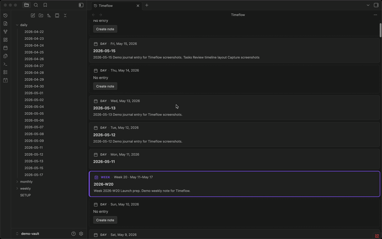

# Timeflow

An [Obsidian](https://obsidian.md/) community plugin that turns your daily Periodic Notes into an infinite vertical **temporal feed** — time as the main way to browse your journal.



## Install

1. Open **Settings -> Community plugins**.
2. Turn on community plugins and select **Browse**.
3. Search for **Timeflow**, install, and enable.

For local development, see [dev.md](dev.md).

## Features

- **Continuous timeline** — daily entries in one scrollable view (newest at the top, no future dates)
- **Mixed stream** — daily, weekly, and monthly note cards; section markers when those periods are off
- **Note cards** — existing notes show a title and plain-text excerpt; click to open
- **Gap placeholders** — missing days appear as interactive cards with **Create note**
- **Infinite scroll** — scroll down to load older days automatically
- **Live updates** — vault changes (create, modify, rename, delete) refresh the feed

## Requirements

- Obsidian **1.5.0** or newer
- [Periodic Notes](https://github.com/liamcain/obsidian-periodic-notes) or core **Daily notes**, with folder and date format configured
- Optional: **Weekly** and **Monthly notes** in Periodic Notes — full cards at period boundaries
- Optional: [Dataview](https://github.com/blacksmithgu/obsidian-dataview) — TABLE queries in a note can appear as plain-text row summaries on the card (no rendered table in the feed)

## Privacy

Timeflow runs entirely offline in your vault. It does not send note contents elsewhere or collect analytics.

## Usage

1. Enable **Timeflow** in **Settings -> Community plugins**.
2. Open the timeline:
   - Click the **history** ribbon icon, or
   - Command palette -> **Open timeline**
3. **Jump to today** from the command palette when needed.
4. Click a card to open a note, or **Create note** on a gap day.

Configure the initial date range and markers in **Settings -> Timeflow**.

## Development

See [dev.md](dev.md) for local setup (`make local-dev`, `make sync-demo` for the [demo vault](demo-vault/SETUP.md)).

```bash
make install
make local-dev
make test
make lint
make build
```

### Project layout

```
src/
  domain/       # Pure timeline logic (tested without Obsidian)
  ports/        # Interfaces (repository, renderer, clock)
  adapters/     # Obsidian and DOM implementations
  presenters/   # Feed orchestration
  views/        # Timeflow ItemView
  commands/     # Plugin commands
tests/          # Vitest unit tests
demo-vault/     # Seed vault for screenshots
```

Architecture follows ports/adapters with a thin `main.ts` composition root. See [AGENTS.md](AGENTS.md) for plugin conventions.

## Releasing

See [RELEASE.md](RELEASE.md) and [CHANGELOG.md](CHANGELOG.md).

## License

0-BSD (see [LICENSE](LICENSE)).
